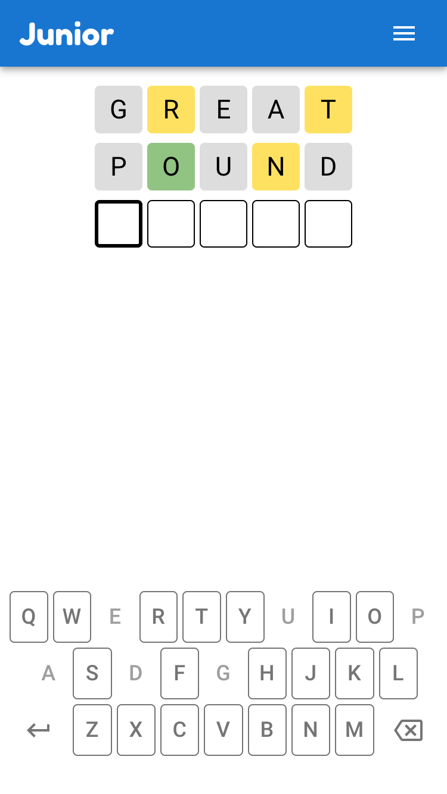
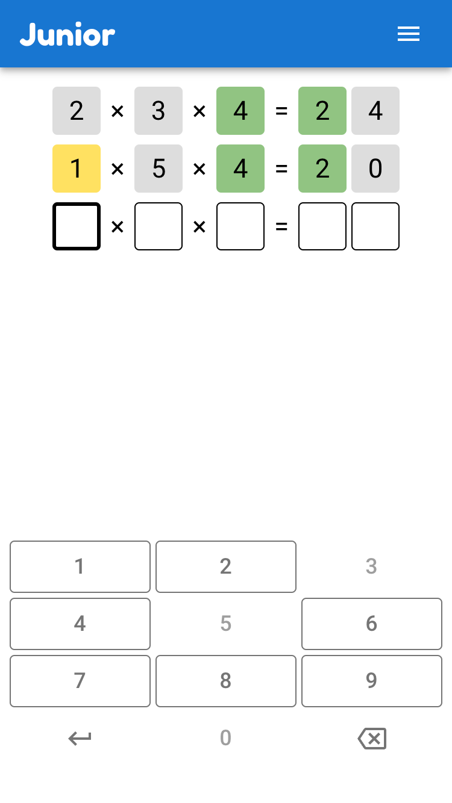

<h1>Junior 🧢</h1>
<em>Yet another <a href="https://en.wikipedia.org/wiki/Wordle" target="_blank">Wordle</a> clone - but with a twist 💃</em>

 

## 💫 Features

- Solve word and math puzzles
- Multiple difficulty levels

    
    
    

 

## 🛠️ Development

This project was bootstrapped with [Create React App](https://github.com/facebook/create-react-app) and is deployed via [GitHub Pages](https://docs.github.com/en/pages).
