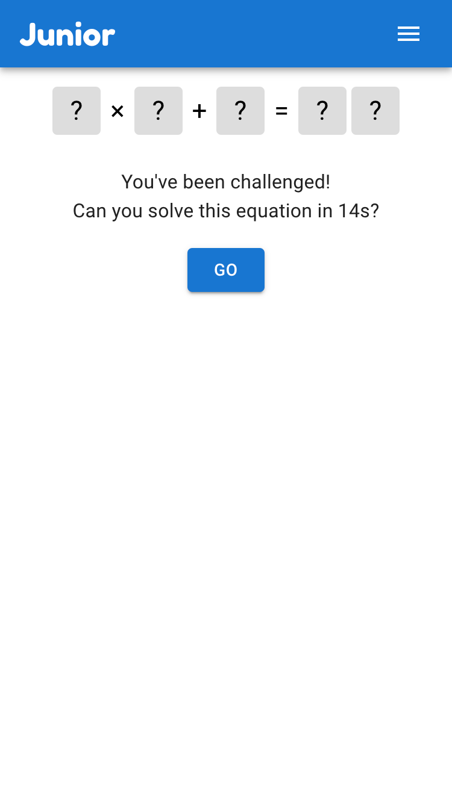

<div align="center">
<h1>Junior 🧢</h1>
<div><a href="https://mzogheib.github.io/junior/#">mzogheib.github.io/junior/#</a></div>
<br />
<em>Yet another <a href="https://en.wikipedia.org/wiki/Wordle" target="_blank">Wordle</a> clone - but with a twist 💃</em>
</div>

## 💫 Features

- Solve words and equations
- Multiple difficulty levels
- Challenge friends to beat your time

<div align="center">
    
    
    
</div>

## 🛠️ Development

[](https://github.com/prettier/prettier)

This project was bootstrapped with [Create React App](https://github.com/facebook/create-react-app) and is deployed via [GitHub Pages](https://docs.github.com/en/pages).

1. Clone the repo and install

   ```sh
   npm i
   ```

2. Start

   ```sh
   npm start
   ```
